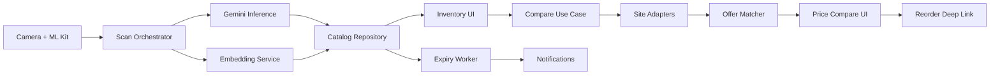
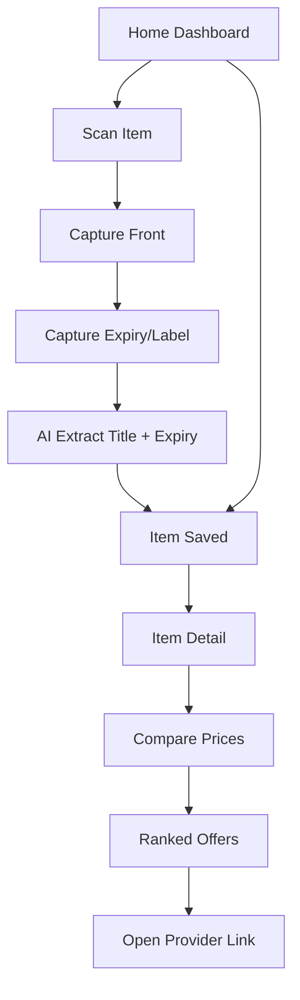

# Groco + Quick Compare Integration Plan (Android-Only)

## 1. Scope Summary
Target: a single Android app (Groco) that supports:
- on-device grocery catalog management,
- quantity tracking,
- expiry tracking + reminders,
- price comparison across online grocery platforms,
- reorder handoff through platform links,
- Gemini-based OCR/LLM assist for product naming and expiry extraction.

Out of scope:
- standalone Python backend/web UI,
- external persistent backend services.

## 2. Current State Findings

### 2.1 Existing Groco
- ML Kit object detection + camera capture pipeline exists.
- MediaPipe image embedding exists with ObjectBox vector nearest-neighbor lookup.
- Gemini calls exist for item-title and expiry-date extraction.
- ObjectBox entity persists title/image/embedding/expiry only.
- UI currently has only:
  - home list,
  - scan screen.

### 2.2 Existing Quick Compare PoC (Python)
- Adapter abstraction and per-site implementations exist.
- Matching logic includes:
  - text normalization,
  - quantity-aware bucketing,
  - fuzzy similarity scoring,
  - cross-site cluster ranking.
- Includes fallback scrape paths (mirror/browser-based) and site-level error transparency.

### 2.3 Gap to Target
- No Android-native compare module in Groco.
- No quantity lifecycle management UI/state.
- No reorder flow in mobile UI.
- No expiry notification worker/channel.
- No robust app-level test suite for these features.

## 3. Target Architecture

## 4. Component Design (Android Kotlin)

### 4.1 Domain Layer
- `compare/domain`:
  - `Offer`, `MatchedItem`, `CompareRequest`, `CompareResult`.
  - `TextNormalizer`, `QuantityParser`, `OfferMatcher`.
- `inventory/domain`:
  - expiry and quantity status calculators.

### 4.2 Data Layer
- `compare/data/adapters`:
  - `PriceSourceAdapter` interface.
  - one adapter per provider (Blinkit, Zepto, Swiggy Instamart, Amazon, JioMart, BigBasket, Flipkart Minutes).
  - parser helpers shared across adapters.
- `compare/data/repository`:
  - parallel fan-out to adapters,
  - per-site error map,
  - local cache (ObjectBox-based compare history).

### 4.3 App Layer
- `CompareViewModel` and compare UI state.
- item detail screen with compare CTA and reorder actions.
- inventory dashboard showing:
  - expiry urgency,
  - low-stock state,
  - quick reorder list.

### 4.4 Notifications
- WorkManager periodic task (daily) + one-off immediate refresh.
- Android notification channel for expiry reminders.
- user-level settings for reminder window.

## 5. UX Flow

## 6. Build Phases

### Phase 1
- Port compare domain logic from Python to Kotlin.
- Add unit tests for matcher/quantity/text utils.

### Phase 2
- Implement Android adapter framework + first provider adapters.
- Add compare repository with per-site error handling and cache.

### Phase 3
- Add item detail + compare UI screens.
- Introduce quantity management actions.

### Phase 4
- Add expiry reminder worker + notification UX.
- Add reminder settings.

### Phase 5
- E2E hardening + UI polish + release checklist.

## 6.1 Current Implementation Status
- Completed:
  - Kotlin compare domain models, quantity parsing, fuzzy matcher.
  - Android adapter abstraction with multi-site generic scraper adapters.
  - Local compare history cache via ObjectBox (`ComparisonHistory`).
  - Home inventory quantity controls (+/-), low-stock indicator.
  - Compare screen with in-app provider offer list and reorder deep links.
  - Expiry reminder scheduling and notification worker using WorkManager.
  - Maestro E2E suites for inventory seed/cleanup, navigation smoke, quantity management, and compare flow.
- Pending for production-hardening:
  - Real-device execution of all Maestro flows.
  - Emulator/device instrumentation test run.
  - Additional parser robustness fixtures per site.

## 7. Risk & Mitigation
- Site anti-bot variability:
  - keep per-site graceful failure and partial results.
- Parsing drift:
  - fixture-based parser tests and fallback extractors.
- Camera + LLM ambiguity:
  - allow user correction/edit for title and expiry before final save.
- On-device resource usage:
  - timeout bounds and coroutine concurrency controls.

## 8. Funding Pitch Artifacts
- Problem to solution map (inventory + reorder automation).
- Differentiators:
  - local-first inventory intelligence,
  - smart scan + expiry reminders,
  - in-app real-time cross-platform comparison.
- Reliability narrative:
  - layered adapter strategy,
  - transparent site status,
  - resilient offline/local catalog core.
